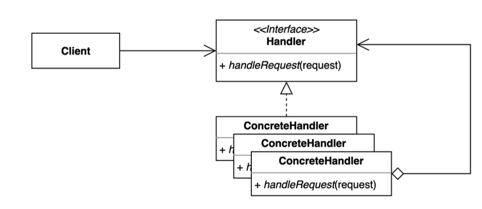
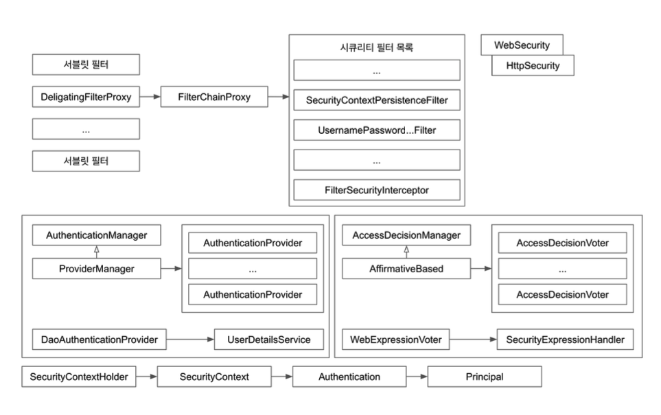

# 책임 연쇄 패턴(Chain Of Responsibility) 패턴
요청을 보내는 쪽(sender)과 요청을 받는 쪽(receiver)을 분리하여 처리하는 패턴이다.

특정 책임이 있는 클래스들이 연결되어 처리하는 패턴이다.

## 책임 연쇄 패턴이 필요한 이유
- SRP를 지키다보면 클래스가 많아지고 구조가 복잡해질 때

## 책임 연쇄 패턴 구조

## 책임 연쇄 패턴 적용해보기

- [테스트 코드](..%2F..%2F..%2F..%2F..%2F..%2F..%2Ftest%2Fjava%2Fcom%2Fkibong%2Fdesignpatternsstudy%2Fbehavioral_patterns%2Fchain_of_responsibility%2FChainOfResponsibilityTest.java)
- [Handler](simple%2FRequestHandler.java)
- [AuthRequestHandler.java](simple%2FAuthRequestHandler.java)
- [LoggingRequestHandler.java](simple%2FLoggingRequestHandler.java)
- [PrintRequestHandler.java](simple%2FPrintRequestHandler.java)

## 책임 연쇄 패턴 장단점
### 장점
- SRP(Single Responsibility Principle)를 지킬 수 있다.
- 원하는대로 다양하게 사용 가능하다.

### 단점
- 연쇄적으로 처리하다보니 디버깅하기 어렵다.

## 사용되는 예시
- Servlet Filter
- Spring Security
