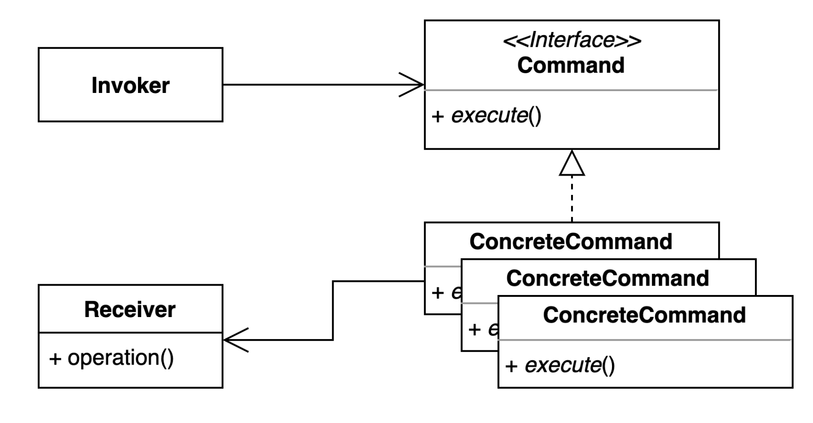

# 커맨드 패턴(Command Pattern)
요청을 캡슐화 하여 호출자와 수신자를 분리하는 패턴
요청을 처리하는 방법이 바뀌더라도 호출자의 코드는 변경되지 않는다.

## 커맨드 패턴을 사용하는 이유
- invoker와 receiver가 서로 밀접하여 수정이 필요하거나 확장이 필요한 경우 서로의 코드를 전부 변경해야할 때

## 커맨드 패턴의 구조

- 요청 자체를 캡슐화 해서 그 명령을 수행하기 위한 모든 작업들을 커맨드라는 인터페이스에 캡슐화 한다.
- invoker는 매우 추상화되어 있는 커맨드라는 인터페이스에 명령을 요청하기만 하면 된다.