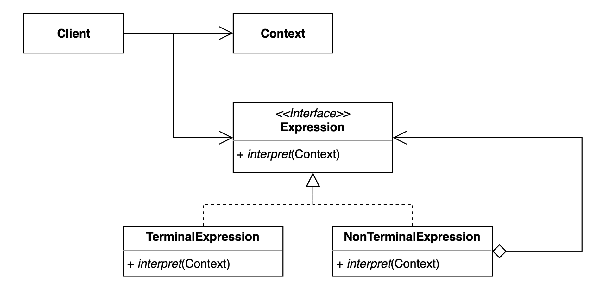

# 인터프리터(Interpreter) 패턴
- 자주 등장하는 문제를 간단한 언어로 정의하고 재사용하는 패턴
- 반복되는 문제 패턴을 언어 또는 문법으로 확장할 수 있다.
- 사람이 작성한 코드를 기계가 이해하기 쉬운 코드로 변환하는 것을 인터프리터라고 하기도 하지만,  
통역하는 사람들 또는 악보를 들을 수 있는 음악으로 변환해주것을 인터프리터라고도 한다.

## Interpreter Pattern을 사용하는 이유
- 자주 사용하는 문법들을 유용하게 사용 가능하다.

## Interpreter Pattern 구조

- Contetext : 모든 Expression에서 공유하는 정보를 저장하는 클래스
- Expression : 실질적으로 표현하는 문법을 나타네는 클래스

## Interpreter Pattern 적용
- [PostfixExpression](simple%2FPostfixExpression.java)
- [PostfixParser](simple%2FPostfixParser.java)
- [VariableExpression](simple%2FVariableExpression.java)
- [PlusExpression](simple%2FPlusExpression.java)
- [MinusExpression](simple%2FMinusExpression.java)

## Interpreter Pattern 장단점
### 장점
- 자주 등장하는 문제 패턴을 언어와 문법으로 정의할 수 있다.
- 기존 코드를 변경하지 않고 새로운 Expression을 추가할 수 있다.
### 단점
- 복잡한 문법을 표현하려면 Expression과 Parser가 복잡해진다.

## Interpreter Pattern 예시
- Java
  - Pattern Matching
- Spring
  - SpEL(Spring Expression Language)