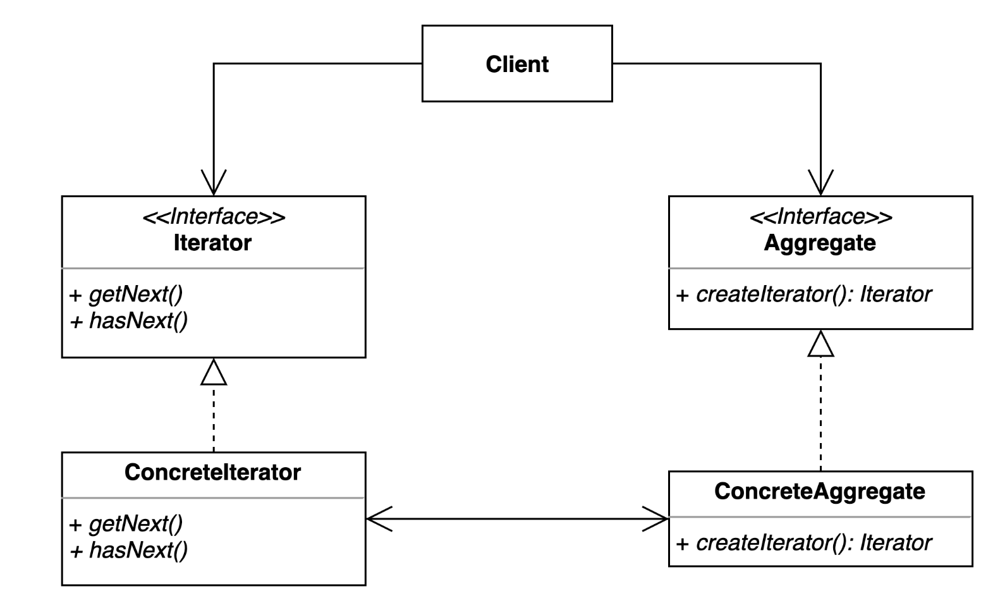

# 이터레이터(Iterator) 패턴
- 집합 객체 내부 구조를 노출하지 않고, 순회하는 방법을 제공하는 패턴
- 직합 객체를 순회하는 클라이언트 코드를 변경하지 않고 다양한 순회 방법을 제공할 수 있다.

## Iterator Pattern을 사용해야하는 경우
- 집합 객체를 순회하는 방법을 변경하고 싶을 때

## Iterator Pattern Structure

- Iterator : 어떻게 순회할 지에 대한 방법을 가지고 있는 인터페이스
  - getNext() : 다음 엘리먼트을 반환하는 메서드
  - hasNext() : 다음 엘리먼트가 있는지 확인하는 메서드
- ConcreteIterator : Iterator의 구체적인 로직
- Aggregate : 있을수도 있고 없을 수도 있다 

## Iterator Pattern 적용
- [Aggregate](simple%2FBoard.java)
- [Client](simple%2FClient.java)
- [ConcreteIterator](simple%2FRecentPostIterator.java)