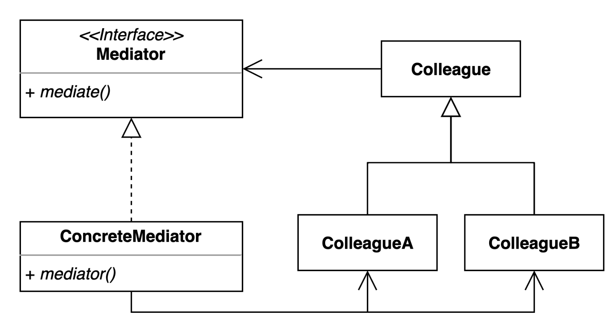

# 중재자(Mediator) 패턴
- 여러 객체들이 소통하는 방법을 캡슐화하는 패턴
- 여러 컴포넌트 간의 결합도를 중재자를 통해 낮출 수 있다.
- 여러 객체들간의 의사소통하는 방법을 추상화하여 객체들간의 의존성, 결합도를 낮추는 패턴

## Mediator Pattern을 사용하는 이유
- 얽힌 객체들을 사용하다보면 기능을 추가할 때 서로의 의존성을 생각하며 추가해야한다.

## Mediator Pattern Structure

- Mediator : 객체들간의 중재자 역할

## Mediator Pattern 적용
- [Client](simple%2FGuest.java)
- [Mediator](simple%2FFrontDesk.java)
- [ColleagueA(CleaningService)](simple%2FFrontDesk.java)
- [ColleagueB(Restaurant)](simple%2FRestaurant.java)

## Mediator Pattern 장단점
### 장점
- 컴포넌트 코들르 변경하지 않고 새로운 중재자를 만들어 사용할 수 있다.
- 각각의 컴포넌트 코드들 보다 간결하게 유지할 수 있다.
### 단점
- 중재자가 많은 역할을 하게 되면 중재자가 복잡해질 수 있다.

## Mediator Pattern Example
- Java
  - ExecutorService
  - Executor
- Spring
  - DispatcherServlet