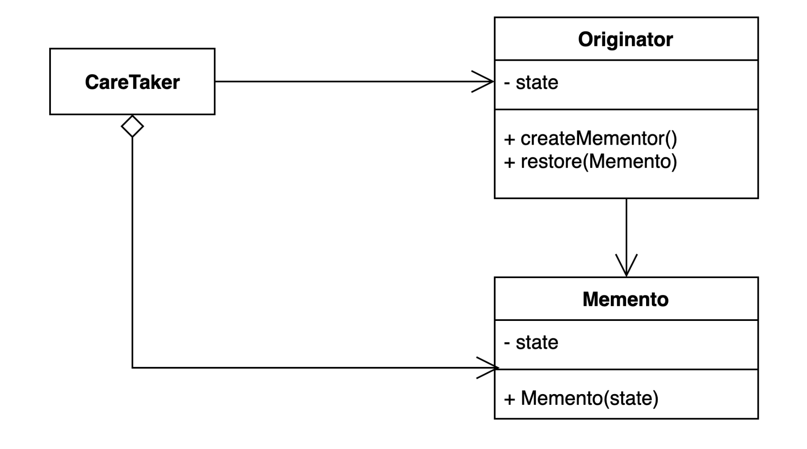

# 메멘토(Memento) 패턴
- 캡슐화를 유지하면서 객체 내부 상태를 외부에 저장하는 방법
- 객체 상태를 외부에 저장했다가 해당 상태로 다시 복구할 수 있다.

## Memento Pattern을 사용하는 이유
- 클라이언트가 객체의 상태 변경을 관리하지 않고, 객체 자체가 상태를 관리하도록 하기 위해 사용한다.

## Memento Pattern Structure

- Originator : 상태를 저장하고 복구하는 객체
- Memento : Originator의 추상화

## Memento Pattern 적용
- [ClientCareTaker](simple%2FClient.java)
- [Originator](simple%2FGame.java)
- [Memento](simple%2FGameSave.java)

## Memento Pattern 장단점
### 장점
- 캡슐화를 지키면서 상태 객체 상태 스냅샷을 만들 수 있다.
  - 어플리케이션을 더욱 유연하게 만들수 있게 된다.(새로운 필드가 추가되거나 변경되더라도 클라이언트 코드가 변경되지 않는다 -> OCP)
- 객체 상태 저장하고 또는 복원하는 역활을 CareTaker에게 위임할 수 있다.(SRP)
- 객체 상태가 바뀌어도 클라이언트 코드는 변경되지 않는다.
### 단점
- 많은 정보를 저장하는 Mementor를 자주 상성하는 경우 메모리 사용량에 많은 영향을 줄 수 있다.

## Java와 Spring에서 Memento Pattern 사용 예
- Java
  - java.io.Serializable
    - 객체의 상태를 Byte Stream으로 변환하는 것을 Serializable(직렬화)이라고 한다.
    - 사용 예(파일 저장, 네트워크 전송, JVM간의 객체 전송)
    - 보낸 객체를 다시 복원하는 것을 Deserializable(역직렬화)이라고 한다.