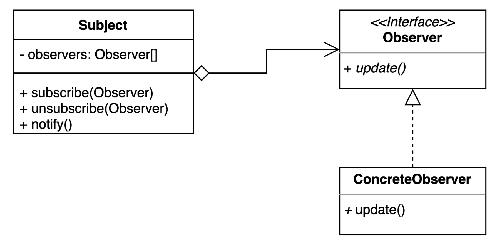

# 옵저버(Observer) 패턴
- 다수의 객체가 특정 객체 상태 변화를 감지하고 알림을 받는 패턴.
- pub/sub 패턴을 구현할 수 도 있다.

## Observer Pattern Structure

- Subject : 상태가 변경되면 자신에게 등록되어 있는 모든 Observer를 순회하며 Observer가 제공하는 특정한 메소드를 호출
- Observer : Subject의 상태가 변경되었을 때 호출되는 메소드를 제공하는 인터페이스
- ConcreteObserver : Observer 인터페이스를 구현한 구체적인 클래스

## Observer Pattern 적용
- [Subject](simple%2FChatServer.java)
- [Observer](simple%2FSubscriber.java)
- [ConcreteObserver](simple%2FUser.java)
