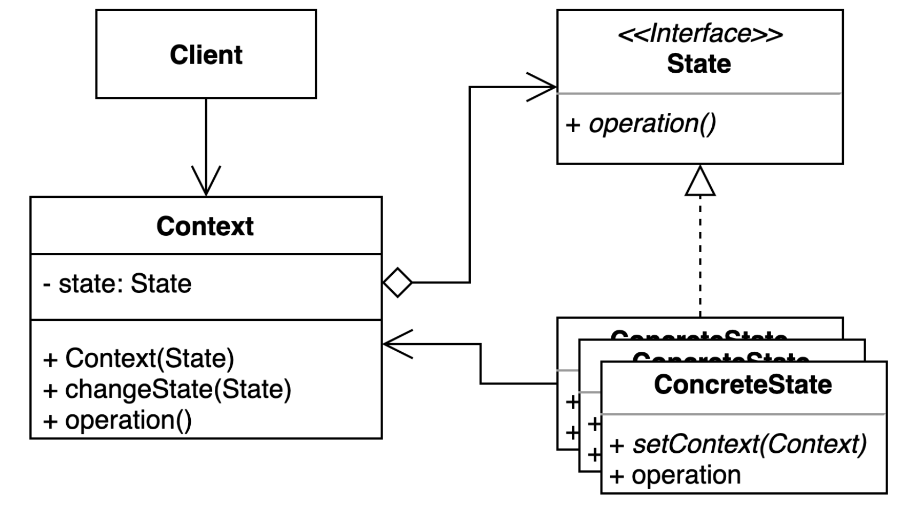

# 상태(State) 패턴

- 객체 내부 상태 변경에 따라 객체의 행동이 달라지는 패턴
- 상태에 특화된 행동들을 분리해 낼 수 있으며, 새로운 행동을 추가하더라도 다른 행동에 영향을 주지 않는다.

## State Pattern 사용하는 경우
- 객체의 상태가 변할 때마다 다른 동작이 필요한 경우
- 객체의 상태 변화가 동적으로 이루어져야 하는 경우

## State Pattern Structure

- State : Context가 변경될 수 있는 여러 상태들에 대한 동통된 인터페이스(필수)
- Context : 상태 변경에대한 Method, 상태 관리하는 Method가 필요하다.
- ConcreteState : State 인터페이스를 구현한 클래스들이다.

## State Pattern 구현

- [Client](simple%2FClient.java)
- [Context](simple%2FOnlineCourse.java)
- [State](simple%2FState.java)
- [ConcreteState](simple%2FDraft.java)
- [ConcreteState](simple%2FPrivate.java)
- [ConcreteState](simple%2FPublished.java)

## State Pattern 장단점
### 장점
- 상태에 따른 동작을 개별 클래스로 옮겨서 관리할 수 있다.(가장 큰 장점)
- 기존의 특정 상태의 따른 동적을 변경하지 않고 새로운 상태에 다른 동작을 추가할 수 있다.
- 코드 복잡도를 줄일 수 있다.
### 단점
- 상태를 나누는게 불필요함에도 나눌 수 있게 될 수도 있다.
- 복잡도가 증가한다.