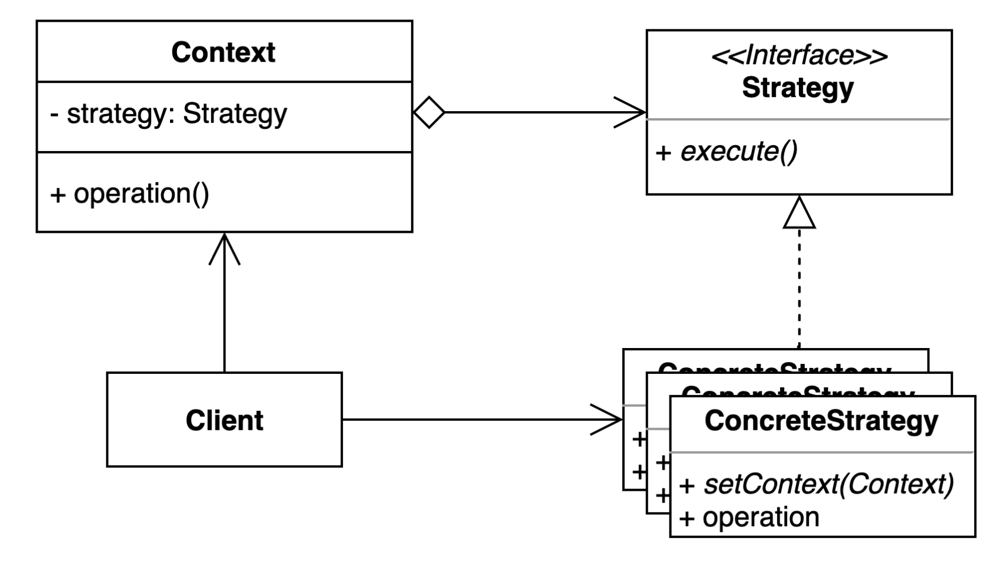

# 전략(Strategy) 패턴

- 여러 알고리즘을 캡슐화하고 상호 교환 가능하게 만드는 패턴
- Context에서 사용할 알고리즘을 클라이언트에서 선택한다.

## Strategy Pattern 사용하는 경우
- 어떤 업무, 어떤 일을 수행하는 방법이 여러 가지일 때
- 알고리즘의 변경 빈도가 높은 경우

## Strategy Pattern Structure

- Context : 원래 로직을 수행하던 클래스 달라지는 로직들을 Strategy 인터페이스로 옮긴다.
- Strategy : 알고리즘을 캡슐화한 Interface, Interface 여야지만 다형성을 사용할 수 있다.

## Strategy Pattern 구현
