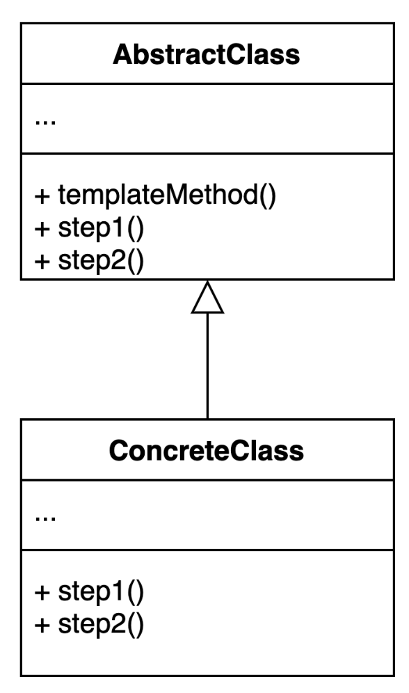
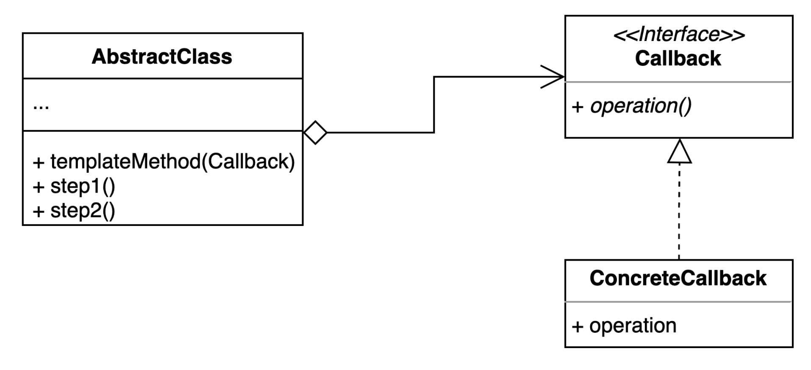

# 템플릿 메소드(Template Method) 패턴
- 알고리즘 구조를 서브 클래스가 확장할 수 있도록 템플릿으로 제공하는 방법
- 추상 클래스는 템플릿을 제공하고 하위 클래스는 구체적인 알고리즘을 제공한다.
- 이러한 방식을 Inversion of Control이라고도 한다.

## Template Method Pattern 적용하는 경우
- 비슷한 알고리즘을 가진 코드들이 중복되는 경우

## Template Method Pattern Structure

## Template-CallBack Pattern
- 콜백으로 상속 대신 위임을 사용하는 템플릿 패턴
- 상속 대신 익명 내부 클래스 또는 람다 표현식을 활용할 수 있다.
- 상속을 사용하지 않아도 됌

### Template-CallBack Pattern Structure

## Template Method Pattern 구현
- [AbstractClass](simple%2FFileProcessor.java)
- [Callback](simple%2FOperator.java)