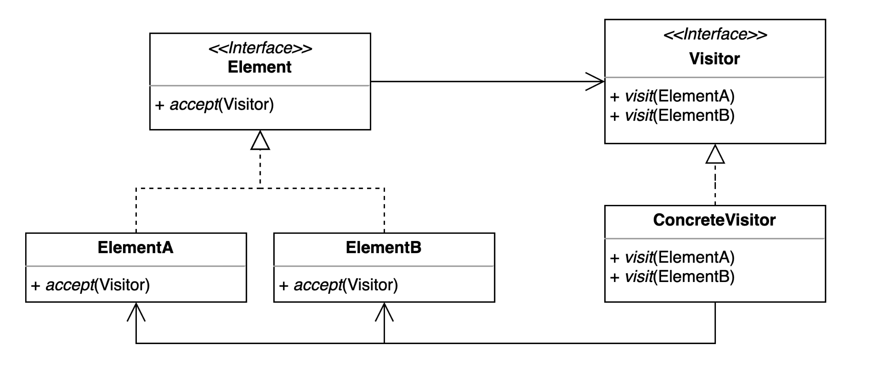

# 방문자(Visitor) 패턴
- 기존 코드를 변경하지 않고 새로운 기능을 추가하는 방법
- 더블 디스패치(Double Dispatch)를 활용할 수 있다.

## Visitor Pattern을 적용하는 경우
- SRP(Single Responsibility Principle)을 준수하면서 새로운 기능을 추가하고 싶은 경우
- 다른 곳에서도 사용될 것 같은 경우

## Visitor Pattern Structure

- Double Dispatch : 구체적인 메소드를 찾아서 배치하는 과정