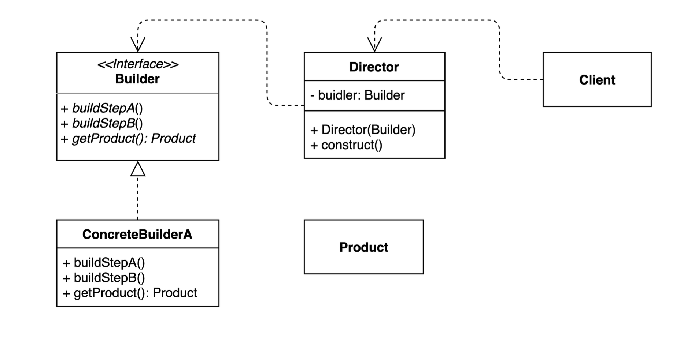

# 빌더(Builder) 패턴
인스턴스를 만들 때 다양한 구성으로 만들어질 수 있는데 다양한 구성으로 만들어 질 수 있게끔하는 패턴이다.

빌더를 사용하면 복잡한 객체를 만드는 프로세스를 독립적으로 분리할 수 있다.

빌더는 디렉터를 추가적으로 사용할 수 있는데
직접 클라이언트와 콘크리트 빌더가 만나는 것이 아닌 반복되는 빌더를 디렉터에 숨겨 디렉터를 통해 가져올 수도 있다. 

## 빌더 패턴 정의 방법
1. 필더 패턴 인터페이스 정의
2. 빌더 패턴의 어떠한 과정을 거쳐서 인스턴스를 만들어 줄지 작성
3. 구현체를 만들기

## 빌더 장단점

### 장점
- 복잡한 개체를 순차적으로 만들 수 있는 방법을 제공 - 복잡한 로직을 잘 분산시켜 인스턴스를 생성 가능하다.
- 복잡한 개체를 만다는 구체적인 과정을 숨길 수 있다. - 보여지는 부분에서 깔끔하게 나타낼 수 있따
- 다른 것에 구애 받지 않고 확장성이 용이
- 불안전한 기체를 사용하지 못하도록 하는 안전장치가 될 수 있다.

### 단점
- 디렉터 혹은 디렉터와 함께 빌더까지 만들어야 함
- 쉽게 만들 수 있는데 구조가 복잡해짐 - 대부분의 디자인 패턴이 가지고 있는 단점
 
## [실무에서 보이는 빌더 패턴](example)
1. StringBuilder
   - String Buffer와 비슷한데 이 둘의 차이는 syncronized를 쓰고 안쓰고의 차이다.
   - String Builder가 syncronized를 쓰지 않는다.
2. StreamBuilder
3. @Builder