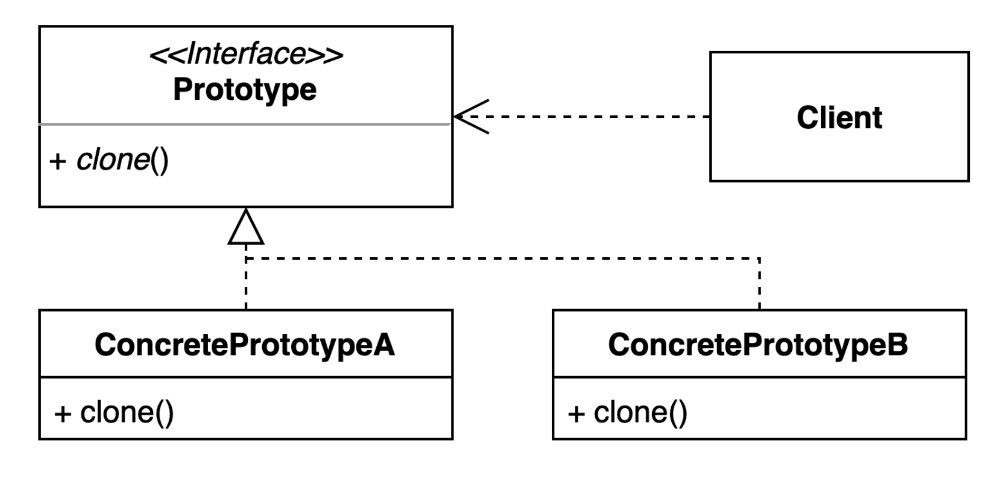

# 프로토타입(Prototype) 패턴

기존 인스턴스를 복제해서 새로운 인스턴스를 만드는 방법
기존의 객체를 응용해서 새로운 인스턴스를 만들 때 유용하게 사용 가능하다.

특히나 DB나 HTTP 요청을 통해 가져온 데이터를 가지고 어떤 인스턴스를 만들어야 할 때  
생성할 때마다 DB나 HTTP 요청을 하는것은 매우 비효율 적이다.  
한번에 호출해서 새로운 인스턴스를 만들어낸다면 확장에도 용이하고 원하는 것만 사용하기에도 효율적으로 사용 가능할 것이다.

## 프로토타입(Prototype) 구조

프로토 타입 모양을 보면 프로토타입 인터페이스에서 제공하는 Clone이라는 메서드가 있다.  
클론 이라는 메서드를 통해서 복제 기능을 제공할 클래스들이 인스턴스를 구현하도록 제공하는 것이다.

## Clone으로 생성한 인스턴스는 원래 인스턴스와 같을까?

- Clone으로 생성한 인스턴스는 원래 인스턴스와 다르다. !=
- 하지만 equals를 쓴다면 값을 비교하는 것이므로 같다. .equals()

## 적용하는 방법
프로토나입 패턴은 다른 디자인 패턴과 다르게 자바를 통해 생성 가능하다. 

## 사용시 주의점

clone()은 얕은 복사를 지원한다.  
얕은 복사란 무엇이냐  
clone() 할 때 파라미터에 있는 인스턴스도 다 같이 새로 생성해서 clone()할 것 같지만   
파라미터에 인스턴스는 그대로 똑같이 사용하게 된다. 

중간에 파라미터의 인스턴스의 필드가 변경된다면 clone()의 값은 변경되어지게 된다.

그럼 깊은 복사는 불가능한가?

깊은 복사 또한 가능하다.
clone의 임의로 코드를 변경함으로써 변경 가능하다.