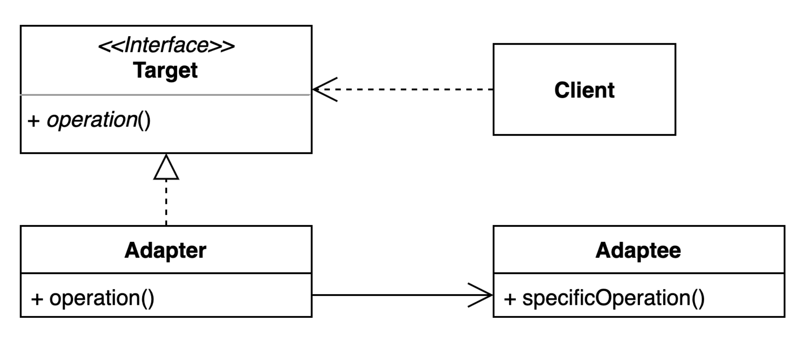

# 어댑터(Adapter) 패턴
기존 코드를 클라이언트가 사용하는 인터페이스의 구현체로 바궈주는 패턴  
어댑터 패턴을 사용하면 코드 재사용과 인터페이스가 다르더라도 활용할 수 있다.

## Adaptor 패턴 장단점

### 장점
- 기존 코드를 변경하지 않고 원하는 인터페이스 구현체를 만들어 재사용 간으하다.
- 기존 코드가 하던일과 특정 인터페이스 구현 변환하는 작업을 각기 다른 클래스로 분리하여 관리할 수 있다.
### 단점
- 어댑터 패턴을 사용하면 새 클래스가 생겨 코드 복잡도가 증가할 수 있다.
- 경우에 따라서는 기존 코드가 해당 인터페이스를 구현하도록 수정하는 것이 좋은 선택이 될 수도 있다.
