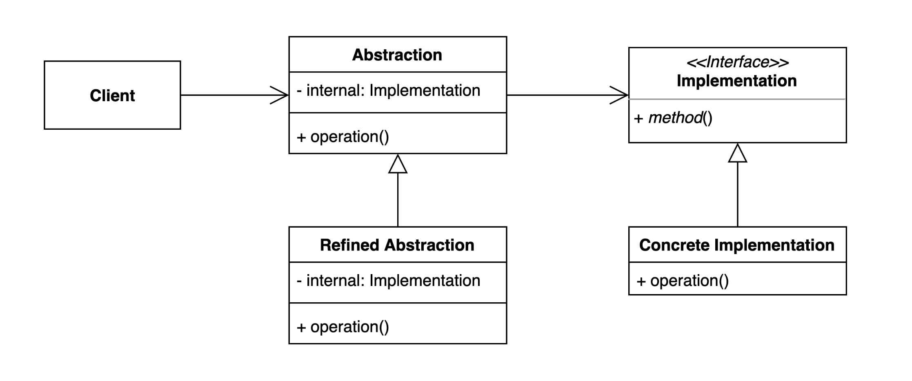

# 브릿지(Bridge) 패턴
어댑터 패턴은 상이한 인터페이스 두개를 연결하는 패턴이다.  
브릿지 패턴은 추상적인 것과 구체적인 것 사이를 연결하는 상속이 아닌 컴포지션을 이용해서 연결하는 패턴이다.
이것을 나누는 것이 추상적인 것과 구체적인 것으로 나뉘기도 하지만 어떤 특징으로 나뉘기도 한다.

EX) 프론트엔드, 백엔드, GUI

하나의 계층구조로 만들다보면 너무 많은 클래스가 생성되어야 한다. 예) [Champion.java](before%2FChampion.java)
이것을 또 다른 계층구조로 만든다면 이 코드를 개선 가능하다.

Client : Abstraction을 사용하는 클래스
Abstraction : 고차원의 추상적인 로직을 담고 있는 클래스
Implementation : 구체적인 정보를 담고 있는 곳 - 구체적인 상태 구체적인 액션
