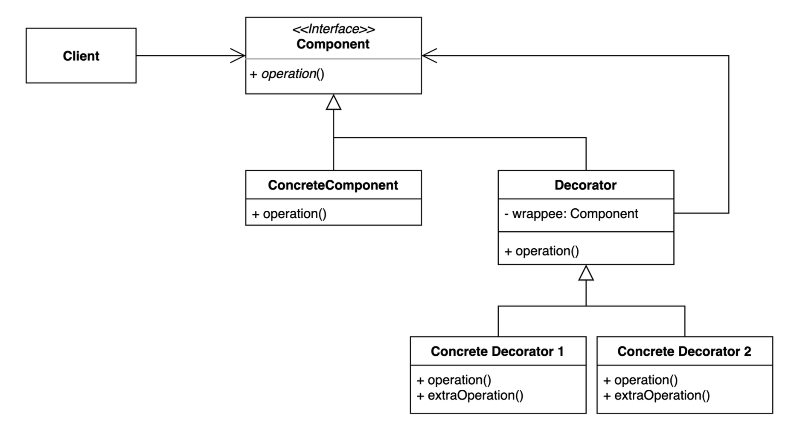

# 데코레이터(Decorator) 패턴
기존의 코드를 변경하지 않으면서 부가적인 기능을 추가해 나갈 수 있는 유용한 구조적인 패턴중 하나  
상속이 아닌 위임을 사용해서 유연하게 사용가능하다.  
(보통 동적으로 유연하게라는 표현이 있으면 런타임에 뭔가를 할 수 있다는 것을 뜻한다.)

상속을 사용하여 확장했을 때에는 확장이 유연하게 작동하지는 않는다.

 - Component : 클라이언트가 사용하는 인터페이스
 - wrappee : 데코레이터가 감싸고 있는 딱 하나의 컴포넌트 타입의 인스턴스 

## [Decorator 패턴 사용해보기](simple%2FCommentDecorator.java)
 - [테스트 코드](..%2F..%2F..%2F..%2F..%2F..%2F..%2Ftest%2Fjava%2Fcom%2Fkibong%2Fdesignpatternsstudy%2Fstructural_patterns%2Fdecorator%2FDecoratorTest.java)
 - [ConcreteComponent](simple%2FCommentService.java)
 - [Decorator](simple%2FCommentDecorator.java)
 - [Concrete Decorator1](simple%2FSpamFilteringCommentDecorator.java)
 - [Concrete Decorator2](simple%2FTrimmingCommentDecorator.java)

properties에서 동적으로 빈을 생성해서 Decorator패턴을 사용할 수 있다.

## 데코레이터 패턴 장단점

### 장점
- 새로운 클래스를 만들지 않고 기존 기능을 조합할 수 있다.
- SRP(Single Responsibility Principle)을 지킬 수 있다.
- 컴파일 타임이 아닌 런타인에 동적으로 기능을 변경할 수 있다.