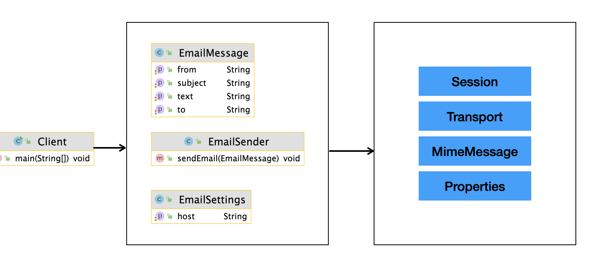

# 퍼사드(Facade) 패턴
코드를 짤 때 어떤 특정한 라이브러리나 어떤 프레임워크 코드에 의존하는 것은 좋지 않다.(느슨한 결합)
의존성이 높아지면 코드를 변경하기 어렵고 코드를 테스트하기에도 어렵다.

Facade 건물의 입구쪽 전경을 의미하는 단어로, 여러 개의 서브 시스템을 사용하는 복잡한 시스템을 숨기는 패턴이다.
복잡한 서브 시스템 의존성을 최소화하는 방법.

서브 시스템(라이브러리 또는 프레임 워크 등)을 사용하는 코드를 숨기고, 
간단한 인터페이스를 제공하는 것이 퍼사드 패턴이다.