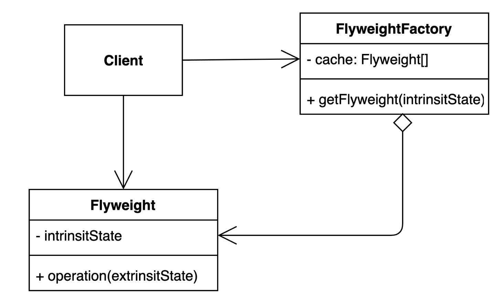

# 플라이 웨이트(Flyweight) 패턴
- 객체를 가볍게 만들어 메모리 사용을 줄이는 패턴
- 자주 변하는 속성과 변하지 않는 속성을 분리하고 재사용하여 메모리 사용을 줄이는 패턴
- 변하지 않는 속성을 Flyweight 객체로 만들어 재사용하여 메모리 사용을 줄임

## 플라이 웨이트가 필요한 이유
- 어플리케이션에서 많은 인스턴스를 만들다보니 메모리 사용량이 증가 -> Out Of Memory 발생

## 플라이 웨이트 구조

## 플라이 웨이트 패턴 사용해보기
- [테스트 코드](..%2F..%2F..%2F..%2F..%2F..%2F..%2Ftest%2Fjava%2Fcom%2Fkibong%2Fdesignpatternsstudy%2Fstructural_patterns%2Fflyweight%2FFlyweightTest.java)
- [공통적인 것(Font)](simple%2FFont.java)
- [캐릭터 객체](simple%2FCharacter.java)
- [Font 팩토리](simple%2FFontFactory.java)

## 플라이 웨이트 패턴 장단점
### 장점
- 어플리케이션에서 사용하는 메모리를 줄일 수 있다. 
### 단점
- 코드의 복잡도가 증가한다. -> Pull Request에 잘 설명해 놓는 방법으로 해결해야한다.

## 플라이 웨이트가 사용된 예시
- valueof() 메소드 : time performance by caching frequently requested values.  
자주 사용되는 값들은 캐싱을 해서 처리한다.