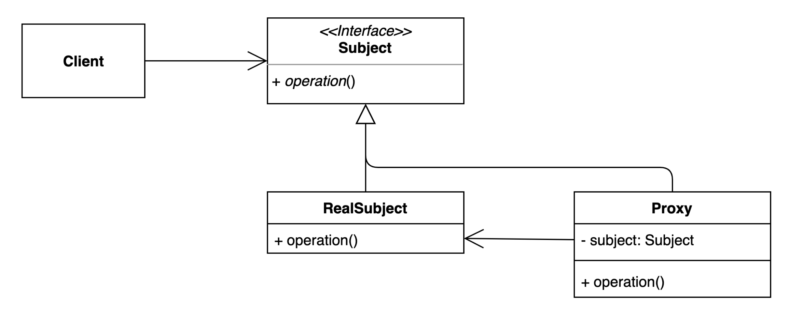

# 프록시 패턴(Proxy Pattern)
- 특정 객체에 대한 접근을 제어하거나 기능을 추가할 수 있는 패턴  
- 프록시를 거쳐서 사용하는 패턴

## 프록시 패턴을 사용하는 이유
- 원래 코드를 변경하지 않고 부가적인 기능을 추가하고 싶을 때(초기화 지연, 접근 제어, 로깅, 캐싱)

## 프록시 패턴 구조

### 프록시 패턴 사용해보기
- [ProxyTest](..%2F..%2F..%2F..%2F..%2F..%2F..%2Ftest%2Fjava%2Fcom%2Fkibong%2Fdesignpatternsstudy%2Fstructural_patterns%2Fproxy%2FProxyTest.java)
- [Proxy Interface](simple%2FGameService.java)
- [Proxy](simple%2FGameServiceProxy.java)
- [Real Subject](simple%2FGameServiceProxy.java)

## 프록시 패턴 장단점
### 장점
- 원래 객체를 변경하지 않고 부가적인 기능을 추가할 수 있다.
- 기존 코드가 해야 하는 일만 유지할 수 있다.
- 기능 추가 및 초기화 지연 등으로 다양하게 활용할 수 있다.
### 단점
- 코드의 복잡도가 증가한다.

## 프록시가 사용된 예시
- Java
  - Dynamic Proxy, java.lang.reflect.Proxy
- Spring
  - AOP(Aspect Oriented Programming)
    - Transactional
    - Cache
    - Security
    - Logging
    - Validation
    - Exception Handling
    - Lazy Loading
    - Etc
